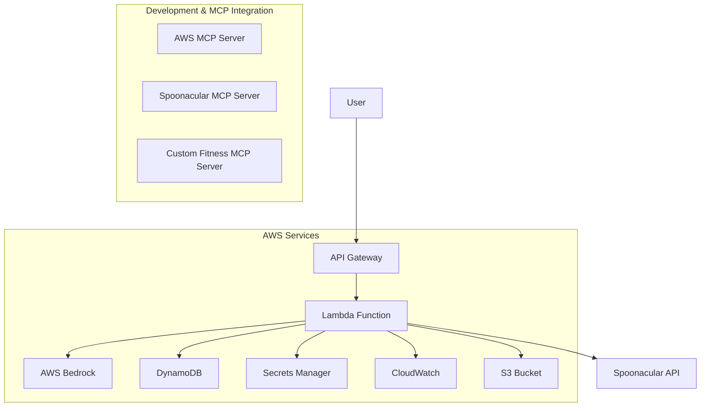

# Design Document

## Overview

The Fitness Health Coach is a serverless AWS chatbot system that provides personalized fitness and nutrition guidance. The system leverages AWS Bedrock for AI-powered workout recommendations and integrates with the Spoonacular API for meal planning. The architecture follows AWS Well-Architected Framework principles, emphasizing security, scalability, and cost-effectiveness.

## Architecture

### High-Level Architecture



### MCP Server Integration Strategy

The system will leverage MCP servers for enhanced development experience and runtime capabilities:

1. **AWS Documentation MCP Server**: For real-time AWS service documentation and best practices
2. **Custom Spoonacular MCP Server**: For enhanced meal planning with cached responses
3. **Custom Fitness Knowledge MCP Server**: For exercise database and fitness expertise

### Service Architecture

1. **API Gateway**: RESTful API endpoint for user interactions
2. **Lambda Functions**: Serverless compute for business logic
3. **AWS Bedrock**: LLM service for workout plan generation
4. **DynamoDB**: NoSQL database for user sessions and metadata
5. **Secrets Manager**: Secure storage for Spoonacular API keys
6. **S3**: Storage for generated plans and static assets
7. **CloudWatch**: Logging, monitoring, and alerting

### MCP Server Architecture

#### 1. AWS Documentation MCP Server
- **Purpose**: Real-time access to AWS service documentation during development
- **Usage**: Query AWS best practices, service limits, and configuration examples
- **Benefits**: Ensures implementation follows AWS recommendations

#### 2. Custom Spoonacular MCP Server
- **Purpose**: Enhanced meal planning with intelligent caching and nutrition analysis
- **Features**:
  - Cached recipe responses to reduce API calls
  - Nutrition analysis and meal optimization
  - Dietary restriction handling
  - Cost optimization for API usage

#### 3. Custom Fitness Knowledge MCP Server  
- **Purpose**: Comprehensive exercise database and fitness expertise
- **Features**:
  - Exercise form descriptions and safety guidelines
  - Muscle group targeting and workout balancing
  - Progressive overload recommendations
  - Injury prevention guidelines

## MCP Server Implementation

### Development-Time MCP Servers

#### AWS Documentation MCP Server
```json
{
  "mcpServers": {
    "aws-docs": {
      "command": "uvx",
      "args": ["awslabs.aws-documentation-mcp-server@latest"],
      "env": {
        "FASTMCP_LOG_LEVEL": "ERROR"
      },
      "disabled": false,
      "autoApprove": ["search_aws_docs", "get_aws_service_info"]
    }
  }
}
```

**Usage During Development:**
- Query AWS Bedrock model capabilities and pricing
- Get DynamoDB best practices and schema design patterns
- Retrieve Lambda configuration recommendations
- Access CloudWatch monitoring setup guides

#### Custom Fitness MCP Server
```python
# fitness_mcp_server.py
from mcp.server import Server
from mcp.types import Tool

class FitnessMCPServer:
    def __init__(self):
        self.exercise_db = self._load_exercise_database()
        
    async def get_exercise_info(self, exercise_name: str):
        """Get detailed exercise information including form and safety"""
        return self.exercise_db.get(exercise_name)
        
    async def suggest_workout_progression(self, current_plan: dict, user_level: str):
        """Suggest workout progression based on user level"""
        # Implementation for progressive overload recommendations
        pass
```

### Runtime MCP Integration

#### Spoonacular Enhancement MCP Server
```python
# spoonacular_mcp_server.py
import asyncio
from typing import Dict, List
from mcp.server import Server

class SpoonacularMCPServer:
    def __init__(self):
        self.cache = {}  # Redis integration for production
        self.api_client = SpoonacularClient()
        
    async def get_optimized_meal_plan(self, 
                                    dietary_preferences: List[str],
                                    calorie_target: int,
                                    fitness_goals: str) -> Dict:
        """Generate optimized meal plan with caching"""
        cache_key = f"{dietary_preferences}_{calorie_target}_{fitness_goals}"
        
        if cache_key in self.cache:
            return self.cache[cache_key]
            
        # Generate new meal plan with optimization
        meal_plan = await self._generate_optimized_plan(
            dietary_preferences, calorie_target, fitness_goals
        )
        
        self.cache[cache_key] = meal_plan
        return meal_plan
        
    async def analyze_nutrition_balance(self, meal_plan: Dict) -> Dict:
        """Analyze nutritional balance and suggest improvements"""
        # Nutritional analysis logic
        pass
```

## Components and Interfaces

### 1. API Gateway

**Purpose**: Entry point for all user requests
- **Endpoint**: `/fitness-coach`
- **Method**: POST
- **Authentication**: API Key (optional for MVP)
- **Rate Limiting**: 100 requests per minute per IP

**Request Schema**:
```json
{
  "username": "string",
  "userId": "string", 
  "query": "string"
}
```

**Response Schema**:
```json
{
  "success": boolean,
  "data": {
    "workoutPlan": {...},
    "mealPlan": {...}
  },
  "message": "string"
}
```

### 2. Lambda Functions

#### Main Handler Function (`fitness-coach-handler`)
- **Runtime**: Python 3.11
- **Memory**: 512 MB
- **Timeout**: 30 seconds
- **Environment Variables**: 
  - `BEDROCK_MODEL_ID`
  - `DYNAMODB_TABLE_NAME`
  - `S3_BUCKET_NAME`

#### Bedrock Integration Function (`workout-generator`)
- **Purpose**: Generate workout plans using AWS Bedrock enhanced by Fitness MCP server
- **Model**: Claude 3 Haiku (cost-effective for structured responses)
- **MCP Integration**: Connects to Fitness MCP server for exercise database and expertise
- **Input**: User query and profile
- **Output**: Structured 7-day workout plan with enhanced exercise details
- **Enhanced Features**:
  - Exercise form descriptions and safety guidelines
  - Progressive overload recommendations
  - Muscle group balancing validation

#### Spoonacular Integration Function (`meal-planner`)
- **Purpose**: Generate meal plans using Spoonacular API enhanced by MCP server
- **MCP Integration**: Connects to Spoonacular MCP server for caching and optimization
- **API Endpoints**: 
  - `/mealplanner/generate` (meal plan generation)
  - `/recipes/informationBulk` (nutritional details)
- **Enhanced Features**:
  - Intelligent caching to reduce API costs
  - Nutritional optimization based on fitness goals
  - Dietary restriction handling

### 3. AWS Bedrock Configuration

**Model Selection**: Claude 3 Haiku
- **Reasoning**: Cost-effective, fast response times, good for structured outputs
- **Prompt Engineering**: Structured prompts for consistent workout plan format
- **Parameters**:
  - Temperature: 0.3 (consistent outputs)
  - Max Tokens: 2000
  - Top P: 0.9

### 4. DynamoDB Schema

#### Table: `fitness-coach-sessions`
- **Partition Key**: `userId` (String)
- **Sort Key**: `sessionId` (String)
- **TTL**: 24 hours (automatic cleanup)

**Attributes**:
```json
{
  "userId": "string",
  "sessionId": "string", 
  "username": "string",
  "query": "string",
  "workoutPlan": "object",
  "mealPlan": "object",
  "timestamp": "number",
  "ttl": "number"
}
```

#### Table: `api-usage-metrics`
- **Partition Key**: `date` (String, YYYY-MM-DD)
- **Sort Key**: `userId` (String)

**Attributes**:
```json
{
  "date": "string",
  "userId": "string",
  "requestCount": "number",
  "bedrockTokens": "number",
  "spoonacularCalls": "number"
}
```

## Data Models

### User Profile Model
```python
@dataclass
class UserProfile:
    username: str
    user_id: str
    query: str
    session_id: str
    timestamp: datetime
```

### Workout Plan Model
```python
@dataclass
class WorkoutPlan:
    user_id: str
    plan_type: str
    duration_weeks: int
    daily_workouts: List[DailyWorkout]
    
@dataclass 
class DailyWorkout:
    day: str
    exercises: List[Exercise]
    total_duration: int
    
@dataclass
class Exercise:
    name: str
    sets: int
    reps: str
    duration: int
    muscle_groups: List[str]
```

### Meal Plan Model
```python
@dataclass
class MealPlan:
    user_id: str
    week_start: str
    daily_meals: List[DailyMeals]
    total_calories: int
    
@dataclass
class DailyMeals:
    date: str
    breakfast: Meal
    lunch: Meal
    dinner: Meal
    
@dataclass
class Meal:
    recipe_id: int
    title: str
    calories: int
    protein: float
    carbs: float
    fat: float
    prep_time: int
```

## Error Handling

### Error Categories

1. **Input Validation Errors** (400)
   - Missing required fields
   - Invalid data formats
   - Query length limits

2. **External Service Errors** (502/503)
   - Bedrock service unavailable
   - Spoonacular API failures
   - Rate limit exceeded

3. **Internal Service Errors** (500)
   - DynamoDB connection issues
   - Lambda timeout
   - Secrets Manager access failures

### Error Response Format
```json
{
  "success": false,
  "error": {
    "code": "string",
    "message": "string",
    "details": "string"
  },
  "requestId": "string"
}
```

### Retry Logic
- **Bedrock**: Exponential backoff, max 3 retries
- **Spoonacular**: Linear backoff, max 2 retries  
- **DynamoDB**: AWS SDK default retry logic

## Testing Strategy

### Unit Testing
- **Lambda Functions**: pytest with moto for AWS service mocking
- **Data Models**: Validation and serialization tests
- **API Handlers**: Request/response validation

### Integration Testing
- **Bedrock Integration**: Test with actual model calls (dev environment)
- **Spoonacular API**: Test with sandbox/test API keys enhanced by MCP caching
- **DynamoDB**: Local DynamoDB for integration tests
- **MCP Server Testing**: 
  - Mock MCP servers for unit tests
  - Integration tests with actual MCP server connections
  - Performance testing of MCP-enhanced features

### End-to-End Testing
- **API Gateway**: Postman/Newman test suites
- **Full Workflow**: User request → workout + meal plan generation
- **Error Scenarios**: Service failures and timeout handling

### Performance Testing
- **Load Testing**: Artillery.js for API Gateway endpoints
- **Bedrock Latency**: Monitor response times under load
- **DynamoDB Performance**: Read/write capacity monitoring

## Security Considerations

### Authentication & Authorization
- API Gateway with API keys (MVP)
- Future: Cognito User Pools for user authentication
- IAM roles with least privilege access

### Data Protection
- **Encryption in Transit**: HTTPS/TLS 1.2+
- **Encryption at Rest**: DynamoDB and S3 default encryption
- **Secrets Management**: Spoonacular API keys in Secrets Manager

### Input Validation
- Request size limits (max 1MB)
- Query length limits (max 1000 characters)
- SQL injection prevention (parameterized queries)
- XSS protection (input sanitization)

## Monitoring and Observability

### CloudWatch Metrics
- **Lambda**: Duration, errors, throttles, concurrent executions
- **API Gateway**: Request count, latency, 4xx/5xx errors
- **DynamoDB**: Read/write capacity, throttled requests
- **Bedrock**: Token usage, request latency

### Custom Metrics
- Workout plan generation success rate
- Meal plan API success rate
- User satisfaction scores (future enhancement)

### Alarms
- Lambda error rate > 5%
- API Gateway latency > 10 seconds
- DynamoDB throttling events
- Bedrock quota approaching limits

### Logging Strategy
- **Structured Logging**: JSON format with correlation IDs
- **Log Levels**: ERROR, WARN, INFO, DEBUG
- **Retention**: 30 days for cost optimization
- **Sensitive Data**: No PII in logs